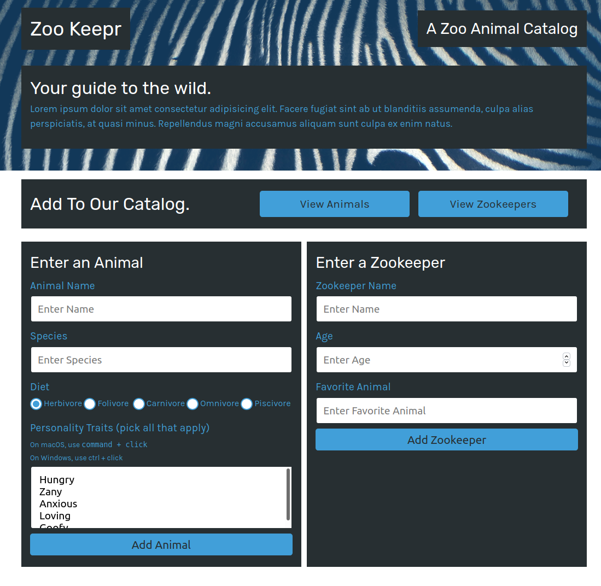

## zookeepr

Animal & zookeeper json database with front end search. Server and api written with Express.js to handle Get and Post requests on the json data. The app is modularized & scalable using routes and tested with the jest framework.

#### Issues

- [x] [Create a web server](https://github.com/MBrassey/zookeepr/1)
- [x] [Allow user creation of data](https://github.com/MBrassey/zookeepr/2)
- [x] [Implement a front end ](https://github.com/MBrassey/zookeepr/3)
- [x] [Incorporate a separate dataset](https://github.com/MBrassey/zookeepr/4)

#### Requirements

- node.js
- npm

#### Installation

    npm i

#### Usage

    npm start
    navigate: http://localhost:3001/

<h6>
:cyclone: Click the image(s) below to view the live <a id="Screenshots" href="https://zookeepr-mbrassey.herokuapp.com/">webapplication</a>
</h6>

[
](https://zookeepr-mbrassey.herokuapp.com/)

[
](https://zookeepr-mbrassey.herokuapp.com/)

[
](https://zookeepr-mbrassey.herokuapp.com/)

[
](https://zookeepr-mbrassey.herokuapp.com/)

#### Questions

Contact me at [matt@brassey.io](mailto:matt@brassey.io) with any questions or comments.

#### License

`zookeepr` is published under the **CC0_1.0_Universal** license.

> The Creative Commons CC0 Public Domain Dedication waives copyright interest in a work you've created and dedicates it to the world-wide public domain. Use CC0 to opt out of copyright entirely and ensure your work has the widest reach. As with the Unlicense and typical software licenses, CC0 disclaims warranties. CC0 is very similar to the Unlicense.
